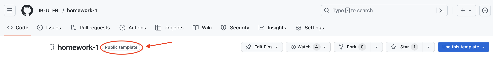
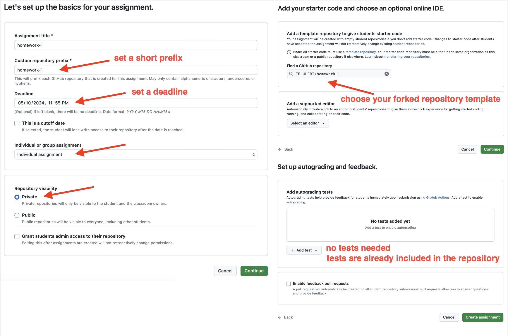

# Setting up the Bioinformatics course

The following instructions inform trainers on how to set up the course environment using assignments from GitHub and GitHub classroom.

## Creating a GitHub organization

1. Follow the [GitHub instructions](https://docs.github.com/en/organizations/collaborating-with-groups-in-organizations/creating-a-new-organization-from-scratch) to create an organization for your course

2. Fork five assignment repositories to your organization.

3. Make sure they are set to PUBLIC TEMPLATE.

## Distributing assignments on GitHub Classroom

1. Create GitHub classroom account with your personal Github account.

2. Create a new classroom within your GitHub organization (and name it accordingly)

3. Create each assignment individually

4. Set assignment name, deadline and template accordingly.

## Distributing the assignment

1. Distribute the assignment link to trainees.

2. They click on the link that creates a PRIVATE repository that is a copy of the template. Repositories are created in the organization of the assignment.

3. Trainees only have to push their code and solutions to their repository

## Assignment grading

1. Trainers can fetch all private repositories in the organization using GitHub CLI.
